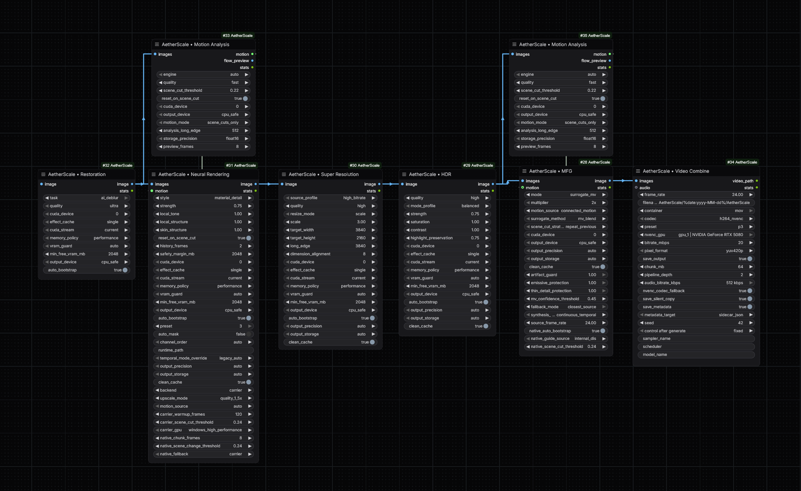

[](ex.png)

# AetherScale for ComfyUI

**GPU-native NVIDIA video enhancement, restoration, temporal analysis, and experimental DLSS 5 Neural Rendering for ComfyUI.**

AetherScale is a Windows/NVIDIA-focused custom node suite for high-quality image and video enhancement with practical long-video memory handling. It combines NVIDIA VFX processing, a CUDA-native HDR-style enhancer, temporal motion analysis, mmap-backed storage, and an experimental DLSS 5 carrier backend in one node pack.

**Author:** noise  
**Current version:** 0.5.4  
**ComfyUI folder:** `ComfyUI-AetherScale`

## What's new in v0.5.4

- Added `clean_cache` to **Super Resolution** and **Neural Rendering**.
- `clean_cache = true` is the default.
- mmap cache files are removed automatically when ComfyUI releases their tensor storage.
- Dead-process/orphan mmap files are cleaned with PID-aware checks.
- Live cache mappings belonging to another running ComfyUI process are preserved.
- Removed the old process-lifetime memmap keepalive that could leave multi-gigabyte `vsr_*.mmap` files behind.

## Features

- NVIDIA VFX Video Super Resolution
- artifact reduction, denoise, and deblur workflows
- built-in CUDA HDR-style tone/color enhancement
- streaming, frame-by-frame processing to reduce peak VRAM/RAM pressure
- mmap-backed output storage for large video batches
- automatic mmap cache cleanup with an optional `clean_cache` switch
- temporal motion analysis with scene-cut detection
- compact FP16 motion storage for long sequences
- experimental DLSS 5 Neural Rendering carrier backend
- DLSS output modes from native 1x through 3x
- automatic runtime discovery/bootstrap with pinned sources and checksum verification
- dedicated diagnostics and runtime-management nodes

## Nodes

| Node | Purpose |
| --- | --- |
| **AetherScale • Super Resolution** | NVIDIA VFX upscaling with streaming/mmap long-video output handling |
| **AetherScale • Restoration** | Artifact reduction, denoise, and deblur |
| **AetherScale • HDR** | CUDA-native HDR-style tone/color enhancement with future native-VFX auto-detection |
| **AetherScale • Motion Analysis** | Current-to-previous motion estimation and scene-cut detection |
| **AetherScale • Neural Rendering** | Experimental DLSS 5 carrier + Neural Rendering pipeline |
| **AetherScale • Neural VRAM Planner** | Memory planning for Neural Rendering workloads |
| **AetherScale • Runtime** | Inspect, bootstrap, repair, or clear private runtimes |
| **AetherScale • Diagnostics** | GPU, CUDA, runtime, and capability reporting |

## Requirements

- Windows 10/11 64-bit
- NVIDIA RTX GPU
- current NVIDIA display driver
- ComfyUI with Python 3.10+
- internet access on first use for optional runtime bootstrap components

The experimental DLSS 5 path is hardware/driver/runtime dependent. RTX 50-series hardware is the primary target for the stock Neural Rendering runtime; compatibility of other generations depends on the selected runtime path.

## Installation

### ComfyUI Manager / Registry

Once published to the Comfy Registry, search for **AetherScale** in ComfyUI Manager and install it normally.

### Git

Clone into `ComfyUI/custom_nodes`:

```bash
git clone https://github.com/vizart-vj/ComfyUI-AetherScale.git
```

Then restart ComfyUI.

### Manual

Extract the folder so the final path is:

```text
ComfyUI/custom_nodes/ComfyUI-AetherScale/
```

The root folder name is intentionally stable and must remain `ComfyUI-AetherScale`.

## Quick start

For conventional upscaling, start with **AetherScale • Super Resolution** and use the automatic memory controls.

For temporal DLSS 5 experiments:

1. connect the image/video frame batch to **AetherScale • Motion Analysis**;
2. keep `motion_mode = compact_flow` for long sequences;
3. connect its motion output to **AetherScale • Neural Rendering**;
4. use `backend = carrier`;
5. start with `upscale_mode = native_1x` to validate the Neural Rendering path before testing 1.5x/2x/3x modes.

`motion_source = auto` uses a compatible connected motion packet when available and can fall back to internal current-to-previous motion estimation.

## Long-video memory architecture

AetherScale avoids moving an entire video batch to CUDA when the operation can be streamed. The main enhancement paths process frames incrementally and large outputs can use FP16 plus mmap-backed CPU storage.

### `clean_cache`

`clean_cache` is available on mmap-backed **Super Resolution** and **Neural Rendering** outputs.

- `true` — recommended/default. The backing `.mmap` file is deleted when ComfyUI releases the associated tensor storage.
- `false` — preserves the backing mmap file after the tensor is released for debugging/manual cache reuse scenarios.

AetherScale also removes orphaned cache files from dead processes while protecting mappings owned by another live ComfyUI process.

This substantially reduces persistent disk usage as well as peak memory pressure, but downstream ComfyUI nodes can still materialize or copy a full IMAGE batch. For extremely long/high-resolution videos, the next node in the workflow must also be memory-conscious.

## HDR backend

Current NVIDIA Video Effects SDK releases do not expose a public HDR effect. AetherScale therefore uses its built-in CUDA HDR-style enhancer while preserving the existing HDR node controls:

- profile (`balanced / cinematic / punchy / natural`)
- strength
- saturation
- contrast
- highlight preservation

If a future NVIDIA VFX runtime exposes a compatible HDR effect, AetherScale can select it automatically. The node outputs normalized ComfyUI IMAGE tensors; it performs HDR-style tone/color enhancement and does not attach HDR10/PQ mastering metadata.

## Runtime bootstrap and security

AetherScale does **not** store downloaded runtime binaries in the Git repository. Runtime/cache directories are ignored by Git.

Depending on the selected node/backend, AetherScale may use or bootstrap:

- `nvidia-vfx==0.1.0.1` for NVIDIA VFX processing;
- the pinned `Merserk/dlss5-visual-enhancer` v1.0 portable release for the experimental carrier backend;
- the pinned MIT bridge/caller from `lisitskyaa/ComfyUI-DLSS5-NR` for the legacy direct diagnostic backend;
- selected DLSSNR runtime packages for the legacy direct backend.

Pinned archives are verified against hard-coded SHA-256 values before use. See [THIRD_PARTY_NOTICES.md](THIRD_PARTY_NOTICES.md) for the exact sources and hashes.

The **carrier** backend is the default Neural Rendering path. `legacy_direct` is retained only for diagnostics/reproducibility and is not the recommended path.

## GPU selection

The NVIDIA VFX/CUDA paths use CUDA device selection. The carrier backend uses D3D12/DXGI and therefore follows Windows graphics adapter routing rather than PyTorch CUDA indexing. AetherScale applies a per-application Windows **High Performance** GPU preference to the carrier worker and reports the expected adapter in node statistics.

## Development status

The VFX enhancement nodes are the stable portion of the project. DLSS 5 Neural Rendering remains **experimental** and is expected to evolve as public runtime behavior, drivers, and community implementations mature.

When reporting a Neural Rendering issue, include:

- GPU model(s)
- NVIDIA driver version
- AetherScale version
- full ComfyUI traceback
- AetherScale `stats` output when available

## Third-party software

AetherScale is an independent community project and is not affiliated with or endorsed by NVIDIA, Topaz Labs, RenoDX, ReShade, or the referenced third-party projects.

AetherScale source code is licensed under the MIT License. Third-party components retain their own licenses and terms. No third-party license is replaced or relicensed by this repository.

See [THIRD_PARTY_NOTICES.md](THIRD_PARTY_NOTICES.md).

## License

MIT License — Copyright (c) 2026 **noise**.
